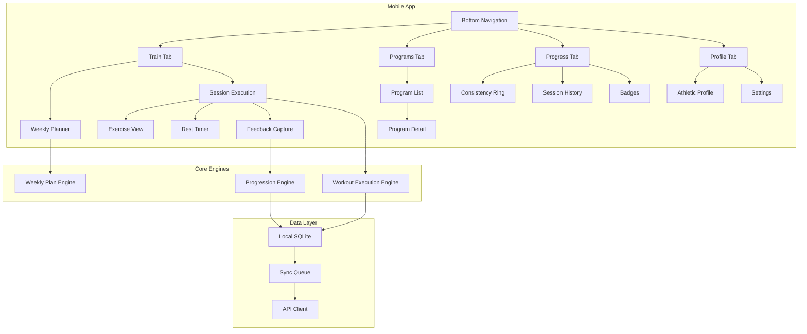

# App Architecture

## Tech Stack

| Layer | Technology | Rationale |
|-------|------------|-----------|
| **Mobile** | React Native + Expo | Fast cross-platform, large ecosystem |
| **State** | Zustand + React Query | Lightweight, offline-first patterns |
| **Local DB** | SQLite (expo-sqlite) | Offline sessions, sync queue |
| **Backend** | Node.js + Express | REST API, scalable |
| **Database** | PostgreSQL | Relational data, ACID compliance |
| **Auth** | OAuth 2.0 + JWT | Google/Apple sign-in + email |
| **Media CDN** | Cloudflare/AWS CloudFront | Fast video/animation delivery |
| **Analytics** | PostHog (self-hosted option) | Privacy-respecting telemetry |

---

## Folder Layout

```
apex-athletic/
├── app/                          # React Native App
│   ├── src/
│   │   ├── components/           # Reusable UI components
│   │   │   ├── ExerciseCard/
│   │   │   ├── LargeCTA/
│   │   │   ├── ProgressRing/
│   │   │   ├── PerceivedDifficultyPicker/
│   │   │   ├── SessionCalendarTile/
│   │   │   └── WeeklyPlanScroller/
│   │   ├── screens/              # Screen components
│   │   │   ├── onboarding/
│   │   │   ├── train/
│   │   │   ├── programs/
│   │   │   ├── progress/
│   │   │   └── profile/
│   │   ├── navigation/           # React Navigation config
│   │   ├── hooks/                # Custom hooks
│   │   ├── store/                # Zustand stores
│   │   ├── services/             # API & sync services
│   │   ├── engines/              # Core logic
│   │   │   ├── progression/
│   │   │   ├── weeklyPlanner/
│   │   │   └── workoutExecution/
│   │   ├── models/               # TypeScript interfaces
│   │   ├── utils/                # Helpers
│   │   ├── constants/            # Theme, config
│   │   └── assets/               # Local assets
│   ├── App.tsx
│   └── app.json
├── server/                       # Backend API
│   ├── src/
│   │   ├── routes/
│   │   ├── controllers/
│   │   ├── services/
│   │   ├── models/
│   │   ├── middleware/
│   │   └── utils/
│   ├── migrations/
│   └── seeds/
├── shared/                       # Shared types/schemas
│   └── types/
└── docs/                         # This documentation
```

---

## Component Map



---

## API Surface

### Authentication
| Endpoint | Method | Description |
|----------|--------|-------------|
| `/auth/register` | POST | Email registration |
| `/auth/login` | POST | Email login |
| `/auth/oauth/:provider` | POST | OAuth (Google/Apple) |
| `/auth/refresh` | POST | Refresh JWT |
| `/auth/logout` | POST | Invalidate session |

### User Profile
| Endpoint | Method | Description |
|----------|--------|-------------|
| `/users/me` | GET | Get current user profile |
| `/users/me` | PATCH | Update profile |
| `/users/me/athletic-profile` | GET | Get athletic profile |
| `/users/me/athletic-profile` | PUT | Update after onboarding |

### Programs
| Endpoint | Method | Description |
|----------|--------|-------------|
| `/programs` | GET | List available programs |
| `/programs/:id` | GET | Program detail with weeks |
| `/programs/:id/enroll` | POST | Start program |
| `/programs/:id/progress` | GET | User's progress in program |

### Workouts
| Endpoint | Method | Description |
|----------|--------|-------------|
| `/workouts/:id` | GET | Workout with exercises |
| `/workouts/today` | GET | Today's scheduled workout |

### Sessions
| Endpoint | Method | Description |
|----------|--------|-------------|
| `/sessions` | POST | Log completed session |
| `/sessions` | GET | Session history |
| `/sessions/sync` | POST | Batch sync from offline |

### Progress
| Endpoint | Method | Description |
|----------|--------|-------------|
| `/progress/snapshot` | GET | Current progress snapshot |
| `/progress/streak` | GET | Streak data |
| `/progress/badges` | GET | Earned badges |

### Media
| Endpoint | Method | Description |
|----------|--------|-------------|
| `/media/exercises/:id` | GET | Exercise demo URLs |
| `/media/upload` | POST | Upload user video (optional) |

### Export & Privacy
| Endpoint | Method | Description |
|----------|--------|-------------|
| `/users/me/export` | GET | GDPR data export |
| `/users/me` | DELETE | Delete account & data |
